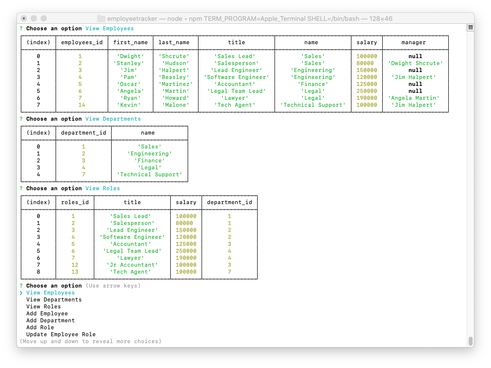

# **Employee Tracker **
  

  
  ## View Program ##
  
  

  * [Video Walk-through](https://www.youtube.com/watch?v=tgz2HEos6r8)

  ## Description ##

  Database controlled employee tracker giving you basic information, salary, role, title, and department of your employees.

  ## Table Of Contents ##

  - [Description](#Description)
  - [Installation](#Installation)
  - [Usage](#Usage)
  - [Contributors](#Contributors)
  - [License](#License)
  - [Tests](#Tests)
  - [Repository](#Repository)
  - [Questions](#Questions)

  ## Installation ##

  1. Extract file.
  1. Run npm install
  1. Run npm start
 
  ## Usage ##

  1. Choose from one of the listed categories
  1. Follow steps for chosen category
  1. Submit all information you are prompted
  1. When finished choose exit to leave application

  ## Contributors ##
  * [Aaron Platt](https://github.com/aaronkplatt)
  * [Matthew Rogers](https://github.com/Rogers-Development-Services)
  * [Nancy Lambert-Brown](https://github.com/n-lambert)
  * [Plover Brown](https://github.com/rebgrasshopper)
  * [Nicholas Konzen](https://github.com/NTKonzen)
  * [Talia Vazquez](https://github.com/taliavazquez)
  * [ShieldsIO](https://shields.io/category/license) 
  * [Nodejs.org](https://nodejs.org/en/)
  * [MySQL](https://www.mysql.com/)

  ## License ##

  https://api.github.com/licenses/mit

  ## Tests ##

  Using jest or mocha you can run tests through the application using npm test.

  ## Repository ##

  - [My Projects Repository](https://github.com/tbsanders5/employeetracker)

  ## Questions ##

  
  - Timothy Sanders
  - [My Profile](https://github.com/tbsanders5)
  - tbsanders5@gmail.com